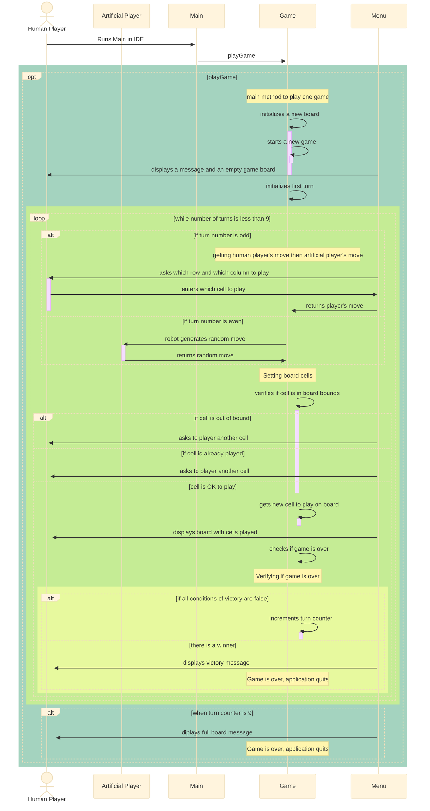

# TicTacToe Game

## Sequence diagram

```mermaid
---
config:
  theme: base
---
sequenceDiagram
  actor User as Human Player
  participant Robot as Artificial Player
  participant Main as Main
  participant Game as Game
  participant Menu as Menu
  User ->>+ Main: Runs Main in IDE
  Main ->>+ Game: playGame
  rect rgba(142, 201, 176, 0.8)
  opt playGame
  Note over Game: main method to play one game
   Game ->>+ Game: initializes a new board
   Game ->>+ Game: starts a new game 
   deactivate Game
   Menu ->> User: displays a message and an empty game board
  deactivate Game
  Game ->>+ Game: initializes first turn
  rect rgba(205, 243, 139, 0.8)
  loop while number of turns is less than 9
    alt if turn number is odd
    Note over Game: getting human player's move then artificial player's move
        Menu ->>+ User: asks which row and which column to play
        activate User
        User ->>+ Menu: enters which cell to play
        Menu ->>+ Game: returns player's move
        deactivate User
    else if turn number is even
        activate Robot
        Game ->>+ Robot: robot generates random move
        Robot ->>+ Game: returns random move
        deactivate Robot
    end
    Note over Game: Setting board cells
    activate Game
    Game ->>+ Game: verifies if cell is in board bounds
    alt if cell is out of bound
        Menu ->>+ User: asks to player another cell
    else if cell is already played
        Menu ->>+ User: asks to player another cell
    else cell is OK to play
        deactivate Game
        activate Game
        Game ->>+ Game: gets new cell to play on board
        deactivate Game
        Menu ->>+ User: displays board with cells played
        Game ->>+ Game: checks if game is over
        Note over Game: Verifying if game is over
        rect rgba(241, 253, 161, 0.8)
        alt if all conditions of victory are false
            Game ->>+ Game: increments turn counter
            deactivate Game
        else there is a winner
            Menu ->>+ User: displays victory message
            Note over Game: Game is over, application quits
        end
        end
    end
    end
    end
    alt when turn counter is 9
        Menu ->>+ User: diplays full board message
        Note over Game: Game is over, application quits
    end
    end
end

```
