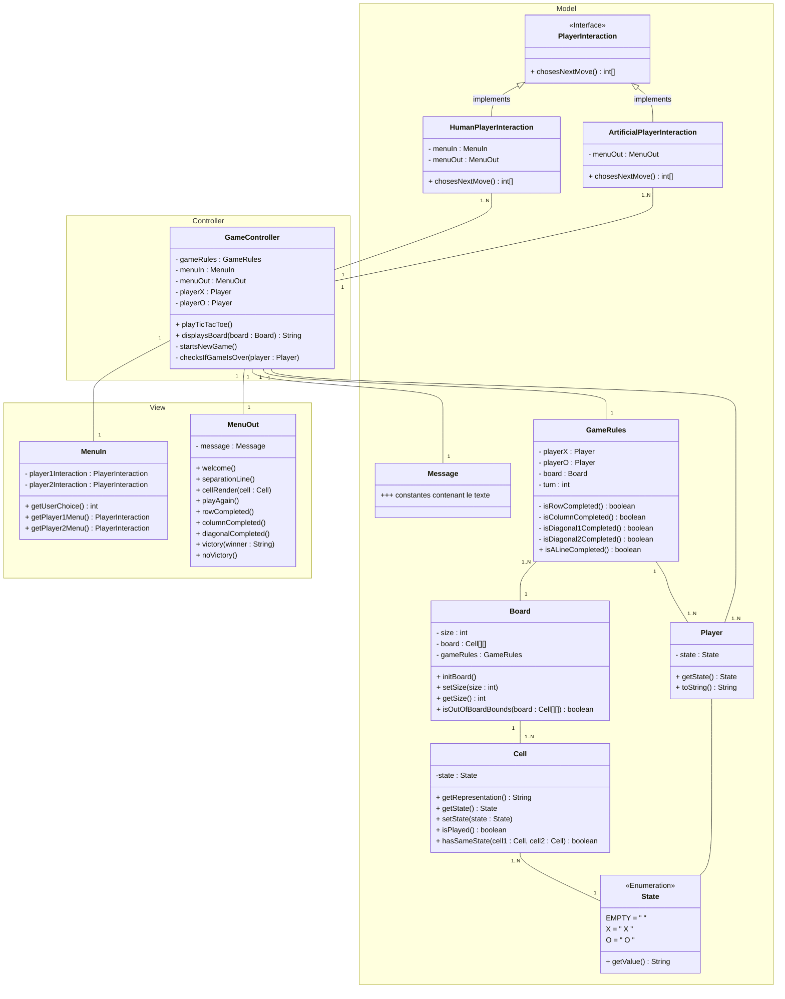
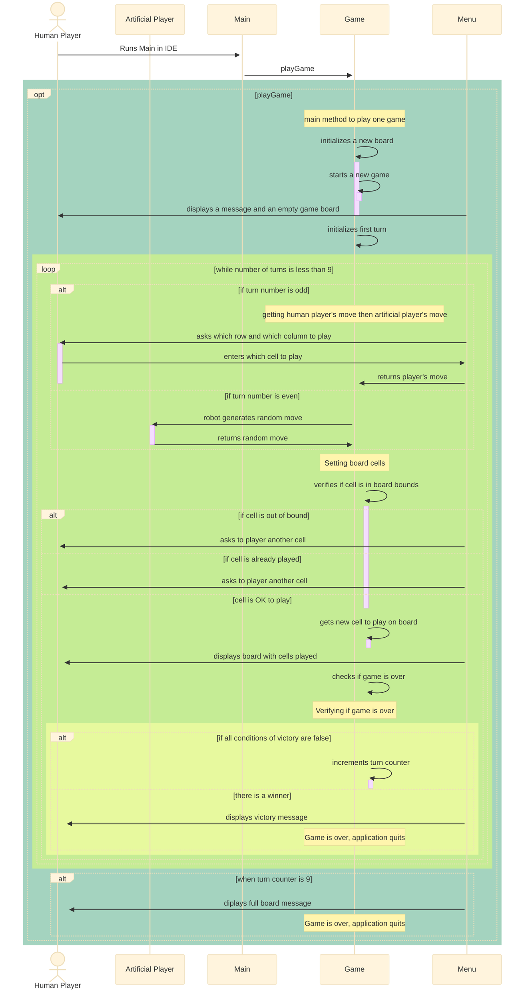

# TicTacToe Game

## MVC classes diagram

```mermaid
classDiagram

namespace View {
    
    class MenuIn :::view {
        - player1Interaction : PlayerInteraction
        - player2Interaction : PlayerInteraction
        + getUserChoice() int
        + getPlayer1Menu() PlayerInteraction
        + getPlayer2Menu() PlayerInteraction
    }

    class MenuOut :::view {
        - message : Message
        + welcome()
        + separationLine()
        + cellRender(cell : Cell)       
        + playAgain()
        + rowCompleted()
        + columnCompleted()
        + diagonalCompleted()
        + victory(winner : String)
        + noVictory()

    }
    
}

PlayerInteraction <|-- ArtificialPlayerInteraction : implements
PlayerInteraction <|-- HumanPlayerInteraction : implements
HumanPlayerInteraction "1..N" -- "1" GameController
ArtificialPlayerInteraction "1..N" -- "1" GameController

GameController "1" -- "1" Message

namespace Model {

    class Message :::view {
        +++ constantes contenant le texte
    }

    class Player :::model {
        - state : State
        + getState() State
        + toString() String
    }

    class Cell :::model {
        -state : State
        + getRepresentation() String
        + getState() State
        + setState(state : State)
        + isPlayed() boolean
        + hasSameState(cell1 : Cell, cell2 : Cell) boolean
    }

    class Board :::model {
        - size : int
        - board : Cell[][]
        - gameRules : GameRules
        + initBoard()
        + setSize(size : int)
        + getSize() int
        + isOutOfBoardBounds(board : Cell[][]) boolean
    }

    class State :::model {
        <<Enumeration>>
        EMPTY = "   "
        X = " X "
        O = " O "
        + getValue() String
    }

    class GameRules :::model {
        - playerX : Player
        - playerO : Player
        - board : Board
        - turn : int
        - isRowCompleted() boolean
        - isColumnCompleted() boolean
        - isDiagonal1Completed() boolean
        - isDiagonal2Completed() boolean
        + isALineCompleted() boolean
    }

    class PlayerInteraction :::view {
        <<Interface>>
        + chosesNextMove() int[]
    }

    class ArtificialPlayerInteraction :::view {
        - menuOut : MenuOut
        + chosesNextMove() int[]
    }

    class HumanPlayerInteraction :::view {
        - menuIn : MenuIn
        - menuOut : MenuOut
        + chosesNextMove() int[]

    }

}

Cell "1..N" -- "1" State
Board "1" -- "1..N" Cell
GameRules "1" -- "1..N" Player
GameRules "1..N" -- "1" Board


namespace Controller {

    

    class GameController :::controller {
        - gameRules : GameRules
        - menuIn : MenuIn
        - menuOut : MenuOut
        - playerX : Player
        - playerO : Player
        + playTicTacToe()
        + displaysBoard(board : Board) String
        - startsNewGame()
        - checksIfGameIsOver(player : Player)
    }
    
}

Player -- State
GameController "1" -- "1" GameRules
GameController "1" -- "1" MenuIn
GameController "1" -- "1" MenuOut
GameController "1" -- "1..N" Player

end

```

## Sequence diagram

```mermaid
---
config:
  theme: base
---
sequenceDiagram
  actor User as Human Player
  participant Robot as Artificial Player
  participant Main as Main
  participant Game as Game
  participant Menu as Menu
  User ->>+ Main: Runs Main in IDE
  Main ->>+ Game: playGame
  rect rgba(142, 201, 176, 0.8)
  opt playGame
  Note over Game: main method to play one game
   Game ->>+ Game: initializes a new board
   Game ->>+ Game: starts a new game 
   deactivate Game
   Menu ->> User: displays a message and an empty game board
  deactivate Game
  Game ->>+ Game: initializes first turn
  rect rgba(205, 243, 139, 0.8)
  loop while number of turns is less than 9
    alt if turn number is odd
    Note over Game: getting human player's move then artificial player's move
        Menu ->>+ User: asks which row and which column to play
        activate User
        User ->>+ Menu: enters which cell to play
        Menu ->>+ Game: returns player's move
        deactivate User
    else if turn number is even
        activate Robot
        Game ->>+ Robot: robot generates random move
        Robot ->>+ Game: returns random move
        deactivate Robot
    end
    Note over Game: Setting board cells
    activate Game
    Game ->>+ Game: verifies if cell is in board bounds
    alt if cell is out of bound
        Menu ->>+ User: asks to player another cell
    else if cell is already played
        Menu ->>+ User: asks to player another cell
    else cell is OK to play
        deactivate Game
        activate Game
        Game ->>+ Game: gets new cell to play on board
        deactivate Game
        Menu ->>+ User: displays board with cells played
        Game ->>+ Game: checks if game is over
        Note over Game: Verifying if game is over
        rect rgba(241, 253, 161, 0.8)
        alt if all conditions of victory are false
            Game ->>+ Game: increments turn counter
            deactivate Game
        else there is a winner
            Menu ->>+ User: displays victory message
            Note over Game: Game is over, application quits
        end
        end
    end
    end
    end
    alt when turn counter is 9
        Menu ->>+ User: diplays full board message
        Note over Game: Game is over, application quits
    end
    end
end

```
